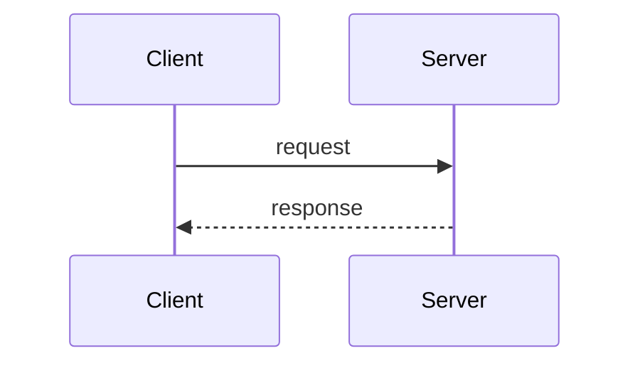
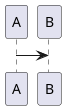

# Folio

Local markdown editor and annotation review tool. A Rust/Axum binary serves a Vite + Tiptap SPA. Agents write structured annotations to a `.folio` sidecar file; humans review them in the browser or via CLI.

The markdown source file is never modified by annotations — they live exclusively in the sidecar.

## Prerequisites

- Rust (stable, via [rustup](https://rustup.rs))
- Node.js 18+ and [pnpm](https://pnpm.io)

## Build

```bash
# Frontend
cd frontend && pnpm install && pnpm build && cd ..

# Binary (skips frontend rebuild if already built)
FOLIO_SKIP_FRONTEND_BUILD=1 cargo build
```

After frontend-only changes, force the binary to pick up the new assets:

```bash
touch src/main.rs && FOLIO_SKIP_FRONTEND_BUILD=1 cargo build
```

A plain `cargo build` rebuilds everything from scratch (runs `pnpm install && pnpm build` via `build.rs`).

## Run

```bash
./target/debug/folio serve path/to/document.md
```

Opens the editor at `http://127.0.0.1:7070` by default. Options:

| Flag | Default | Description |
|---|---|---|
| `--port` | 7070 | Port to listen on |
| `--host` | 127.0.0.1 | Host to bind |
| `--read-only` | off | Disable saves from the browser |
| `--no-open` | off | Don't open the browser automatically |
| `--no-watch` | off | Disable file-change live reload |
| `--plantuml-url` | https://www.plantuml.com/plantuml | PlantUML rendering server |
| `--token` | none | Require `Authorization: Bearer <token>` on all requests |

## CLI commands

```bash
# Review pending annotations
folio review document.md

# Accept all annotations (applies patches to the file)
folio accept document.md --all

# Accept a single annotation by ID
folio accept document.md <id>

# Reject annotations
folio reject document.md --all

# Create an empty sidecar
folio init document.md

# Validate a sidecar file
folio check document.md
```

## Diagrams

Fenced code blocks with language `mermaid` or `plantuml` are rendered inline:

````markdown



````

PlantUML renders via the configured server (SVG with automatic PNG fallback).

## Sidecar format

Annotations are stored in `<document>.folio` as JSON:

```json
{
  "version": 1,
  "annotations": [
    {
      "id": "abc123",
      "kind": "comment",
      "source": "agent",
      "author": "claude",
      "context_before": "text preceding the target",
      "target": "the annotated text",
      "comment": "This could be clearer.",
      "created": "2026-01-01T00:00:00Z",
      "resolved": false
    }
  ]
}
```

Supported kinds: `replace`, `delete`, `insert`, `highlight`, `comment`.
