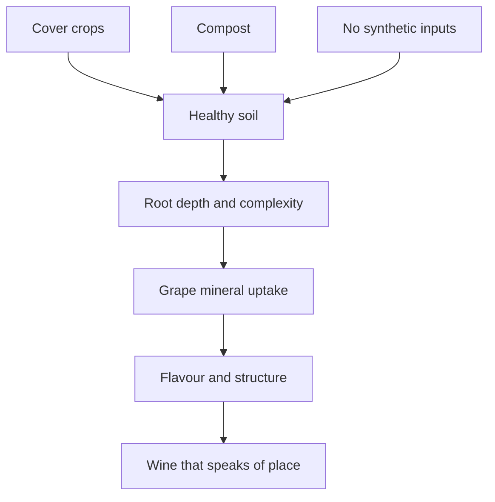
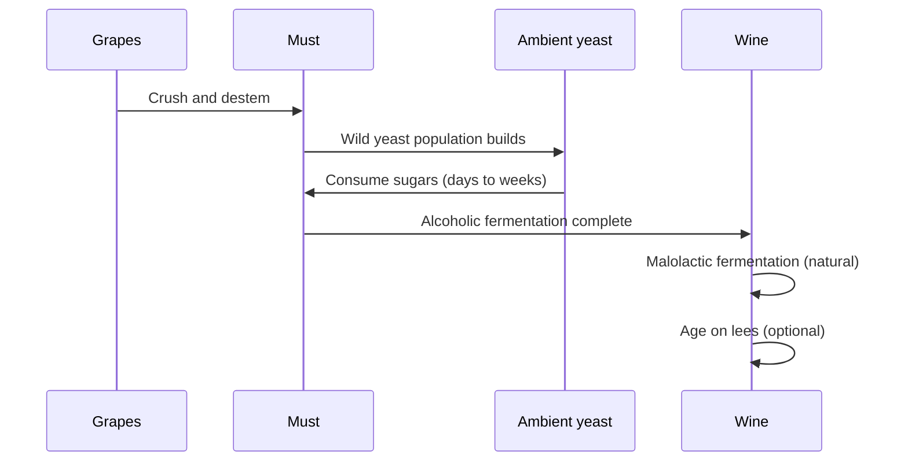
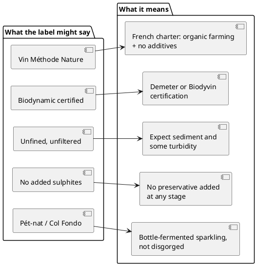

# Natural Wine: A Grower's Guide

## What Is Natural Wine?

Natural wine is made with minimal intervention in both the vineyard and the cellar. No additives, no corrective chemistry — just fermented grape juice, sometimes with a small sulphite addition at bottling. The style sits at the intersection of traditional farming and radical simplicity.

The term has no legal definition, but in practice it means organically or biodynamically farmed fruit, ambient yeast fermentation, and little or no filtration or fining.

## The Vineyard

Everything starts in the soil. Healthy, living soil produces grapes with genuine character that can carry a wine without the need for correction.

Key practices:

- **Cover crops** between rows fix nitrogen and prevent erosion
- **No herbicides or pesticides** — the ecosystem does the work
- **Hand harvesting** avoids mechanical damage and allows selective picking
- **Low yields** concentrate flavour; overcropped vines produce dilute fruit

## Fermentation

Grapes are crushed and left to ferment with whatever yeast is already on the skins. This is the defining step. Wild fermentation is slower, less predictable, and more expressive than inoculated fermentation.

### Maceration

For red wines and some whites, extended skin contact extracts tannin, colour, and texture. Orange wines — whites fermented with skins — can macerate for anywhere from a few days to several months.

| Style | Maceration | Result |
|---|---|---|
| Light red | 5–10 days | Fresh, low tannin |
| Structured red | 20–40 days | Grip, ageing potential |
| Orange wine | 1 week – 6 months | Amber colour, texture, phenolic bite |
| Pét-nat | None (bottled mid-ferment) | Sparkling, hazy, low alcohol |

## Cellar Work

The cellar philosophy is restraint. The winemaker's job is to not get in the way.

- **Vessel choice**: clay amphorae, old oak, or stainless. New oak masks the fruit.
- **No fining**: egg whites, bentonite, and isinglass are all excluded.
- **No filtering**: the wine goes into bottle cloudy. Sediment is expected.
- **Sulphites**: most producers add nothing; a cautious few add 20–30 mg/L at bottling to protect during transport.

## Reading the Label

Natural wine labels often tell you more than conventional ones.

## Common Faults and How to Tell

Natural wine tolerates a degree of variation that would be considered defective in conventional wine. Knowing the difference between a fault and a feature is part of the experience.

| Characteristic | Feature or fault? | Notes |
|---|---|---|
| Light haze | Feature | Unfined/unfiltered; harmless |
| Slight petillance in a still wine | Usually feature | Residual CO₂ from fermentation |
| Volatile acidity (vinegar note) | Fault if dominant | A hint adds complexity; pronounced VA is a flaw |
| Mousiness | Fault | Lactic bacteria producing THP; irreversible |
| Oxidation | Context-dependent | Intentional in some styles (Jura); unintentional elsewhere |
| Sediment | Feature | Lees and tartrates; decant or embrace |

## Serving

Serve cooler than you think. Light reds at 14–16 °C, fuller reds at 16–18 °C. Many orange wines benefit from the same temperature range as a white. Decanting is rarely necessary; a brief swirl in the glass is enough to open most natural wines.

Pour carefully from bottles with sediment, or decant slowly leaving the last centimetre in the bottle.
