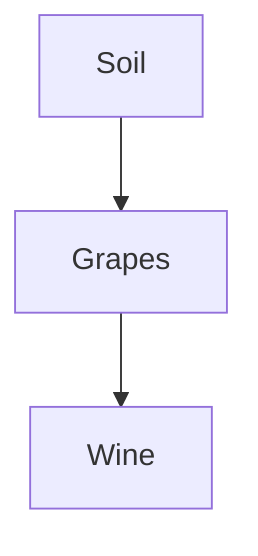
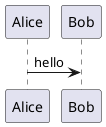

# Self-test document

Natural wine is made with minimal intervention in both the vineyard and the cellar.

```mermaid
flowchart TD
    A[Soil] --> B[Grapes] --> C[Wine]
```

```plantuml
@startuml
Alice -> Bob: hello
@enduml
```

The last paragraph.
